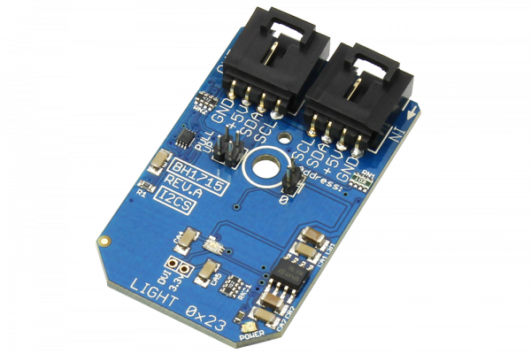

# BH1715

The BH1715 is a digital Ambient Light Sensor with an I2C bus interface.The BH1715 is commonly used to obtain the ambient light data for adjusting LCD and Keypad backlight power for mobile devices.
This device offers a 16-bit resolution and an adjustable measurement range, allowing detection from .23 to 100,000 lux.
This Device is available from www.ncd.io 

[SKU: BH1715_I2CS]

(https://store.ncd.io/product/bh1715-digital-ambient-light-sensor-16-bit-1-to-65535-lux-i%C2%B2c-mini-module/)
This Sample code can be used with Arduino.

Hardware needed to interface BH1715 sensor with Arduino

1. <a href="https://store.ncd.io/product/i2c-shield-for-arduino-nano/">Arduino Nano</a>

2. <a href="https://store.ncd.io/product/i2c-shield-for-arduino-micro-with-i2c-expansion-port/">Arduino Micro</a>

3. <a href="https://store.ncd.io/product/i2c-shield-for-arduino-uno/">Arduino uno</a>

4. <a href="https://store.ncd.io/product/dual-i2c-shield-for-arduino-due-with-modular-communications-interface/">Arduino Due</a>

5. <a href="https://store.ncd.io/product/bh1715-digital-ambient-light-sensor-16-bit-1-to-65535-lux-i%C2%B2c-mini-module/">BH1715 Digital Ambient Light Sensor</a>

6. <a href="https://store.ncd.io/product/i%C2%B2c-cable/">I2C Cable</a>

BH1715:

The BH1715 is a digital Ambient Light Sensor with an I2C bus interface.The BH1715 is commonly used to obtain the ambient light data for adjusting LCD and Keypad backlight power for mobile devices.
This device offers a 16-bit resolution and an adjustable measurement range, allowing detection from .23 to 100,000 lux.

Applications:

•Mobile phones,LCD TVs,laptops,portable game machines,digital cameras,PDAs and LCD displays.

How to Use the BH1715 Arduino Library
The BH1715 has a number of settings, which can be configured based on user requirements.

1.Resolution Mode:The following command is used to set the mode of resolution and measure Ambient light.

          bh.setResMode(CONTINOUS_HIGH);          // Measure Ambient Light, Continous High Resolution Mode
          
2.Resolution per count:The following command is used to set the resolution value per count. 

           bh.setResolution(RESOLUTION_DEFAULT);   // MTreg value: 0100_0101 (MTreg: 69), lx / count: 0.83
